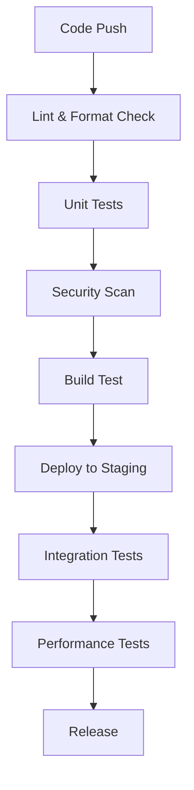

# Testing Strategy

This document outlines the testing approach for GuildForge, ensuring reliability, security, and maintainability.

## Testing Philosophy

- **Test-Driven Development:** Write tests before implementing features when possible
- **Pyramid Approach:** More unit tests, fewer integration tests, minimal e2e tests
- **Quality Gates:** All tests must pass before merging to main branch
- **Security First:** Include security testing at every level

## Test Types

### 1. Unit Tests
**Framework:** Jest + React Testing Library
**Coverage Target:** 80%+ for business logic

**Focus Areas:**
- Component rendering and props
- Utility functions (skill calculations, data helpers)
- State management logic
- Form validation

**Example Test Structure:**
```javascript
describe('SkillMatrix', () => {
  test('calculates skill averages correctly', () => {
    // Arrange
    const mockData = { /* test data */ };
    
    // Act
    const result = calculateSkillAverage(mockData);
    
    // Assert
    expect(result).toBe(expectedValue);
  });
});
```

### 2. Integration Tests
**Framework:** React Testing Library
**Focus:** Component interactions and data flow

**Test Scenarios:**
- Adventurer profile updates
- Skill matrix editing
- Authentication flow
- Data persistence (localStorage)

### 3. Security Tests
**Framework:** Custom security test suite
**Automated:** Part of CI/CD pipeline

**Security Test Areas:**
- **Input Validation:** XSS prevention, data sanitization
- **Authentication:** Admin access controls
- **Data Protection:** No sensitive data exposure
- **Dependency Scanning:** npm audit, Snyk

### 4. Performance Tests
**Tools:** Lighthouse CI, Web Vitals

**Metrics:**
- First Contentful Paint < 2s
- Largest Contentful Paint < 4s
- Cumulative Layout Shift < 0.1
- Time to Interactive < 5s

### 5. Accessibility Tests
**Tools:** jest-axe, Pa11y

**Standards:** WCAG 2.1 AA compliance

**Test Coverage:**
- Keyboard navigation
- Screen reader compatibility  
- Color contrast ratios
- Focus management

## Test Environment Setup

### Local Development
```bash
# Install test dependencies
npm install

# Run unit tests
npm test

# Run tests with coverage
npm run test:coverage

# Run linting
npm run lint
```

### CI/CD Pipeline
```yaml
- name: Unit Tests
  run: npm test -- --coverage --watchAll=false

- name: Security Scan  
  run: |
    npm audit --audit-level=moderate
    trivy fs . --exit-code 1

- name: Build Test
  run: npm run build
```

## Test Data Management

### Sample Data
- **Location:** `src/data/people.json`
- **Privacy:** Fictional adventurer names only
- **Maintenance:** Update when adding new skill categories

### Test Fixtures
```javascript
// tests/fixtures/adventurers.js
export const mockAdventurer = {
  name: "Test Adventurer",
  role: "Full Stack",
  skills: { /* ... */ }
};
```

## Quality Gates

### Pre-commit
- ESLint passes
- Prettier formatting applied
- Unit tests pass

### Pull Request
- All tests pass
- Code coverage maintained
- Security scan passes
- Build succeeds

### Release
- Full test suite passes
- Security vulnerabilities resolved
- Performance benchmarks met
- Documentation updated

## Automated Testing in CI



## Test Maintenance

### Weekly Tasks
- Review test coverage reports
- Update test data if needed
- Check for flaky tests

### Monthly Tasks  
- Dependency updates
- Security audit review
- Performance baseline updates

### Release Tasks
- Full test suite execution
- Security scan results review
- Documentation updates

## Known Testing Challenges

### Browser Compatibility
- **Issue:** Testing across different browsers
- **Solution:** Use Browserstack or similar service

### Async Operations
- **Issue:** Testing localStorage and async state updates
- **Solution:** Use waitFor and proper async/await patterns

### Authentication Testing
- **Issue:** Mocking admin authentication
- **Solution:** Mock environment variables in tests

## Future Improvements

1. **Visual Regression Testing:** Add screenshot comparison tests
2. **Contract Testing:** API contract validation if backend added
3. **Mutation Testing:** Verify test quality with tools like Stryker
4. **Property-Based Testing:** Use fast-check for edge case discovery

## Test Reporting

- **Coverage Reports:** Generated automatically in CI
- **Test Results:** Displayed in PR status checks  
- **Security Reports:** Available in GitHub Security tab
- **Performance Reports:** Lighthouse reports in artifacts

## Getting Help

- **Documentation:** Check React Testing Library docs
- **Team Support:** Ask in team chat or create discussion
- **CI Issues:** Check GitHub Actions logs and status